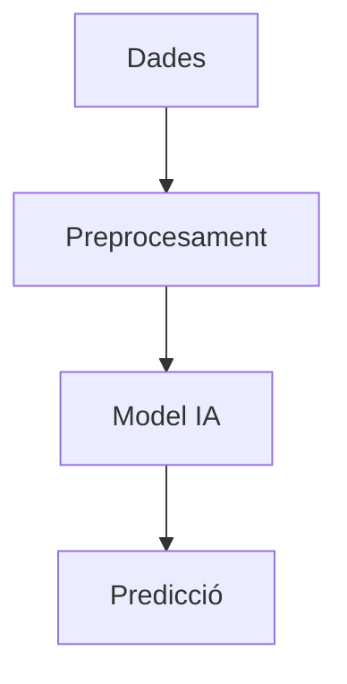

# Manual: Anàlisi de Dades amb IA


## 1. Introducció
Aquest manual està enfocat a explicar l'ús d'intel·ligència artificial (IA) en el camp de l'anàlisi de dades, amb especial relació amb el perfil ASIX (Administració de Sistemes Informàtics i Xarxes). Inclou:


- **Aplicacions de la IA.**
- **Impacte al sector.**
- **Impacte ambiental.**
- **Propostes per minimitzar els impactes ambientals.**


---


## 2. Aplicacions de la IA en Anàlisi de Dades
L'IA ofereix múltiples aplicacions per a l'anàlisi de dades, entre les quals destaquen:


### 2.1. Processament de dades massives (Big Data)
- **Exemple:** Ús d'eines com Apache Spark amb models d'aprenentatge automàtic (MLlib).
- **Aplicació:** Detectar patrons ocults i correlacions complexes en grans volums de dades.


### 2.2. Predicció i forecasting
- **Exemple:** Models predictius amb TensorFlow o PyTorch.
- **Aplicació:** Predicció de vendes, detecció de fraus i estimacions de demanda.


### 2.3. Visualització intel·ligent de dades
- **Exemple:** Eines com Power BI amb integració de models d'IA.
- **Aplicació:** Creació de dashboards que s'adapten automàticament a l'usuari.


### 2.4. Processament del llenguatge natural (NLP)
- **Exemple:** Extracció d'informació rellevant de dades no estructurades amb models com BERT.
- **Aplicació:** Analitzar comentaris d'usuaris o ressenyes.


---


## 3. Impacte al sector


### 3.1. Millores en la presa de decisions
- L'ús de la IA redueix el temps necessari per analitzar dades complexes.
- Proporciona recomanacions basades en dades per millorar processos empresarials.


### 3.2. Creació de noves oportunitats laborals
- Nous rols com a **científic de dades** o **enginyer de machine learning**.


### 3.3. Automatització i eficiència
- Reducció d'errors manuals gràcies a sistemes automatitzats.
- Optimització de recursos a partir de prediccions precises.


---


## 4. Impacte ambiental


### 4.1. Consum energètic elevat
- L'entrenament de models IA requereix gran potència computacional.
 - **Exemple:** Entrenar GPT-3 consumeix una energia equivalent a l'emissió de diverses tones de CO2.


### 4.2. Residus electrònics
- Renovació constant de maquinari per mantenir l'eficiència en els processos.


### 4.3. Emissions indirectes
- Data centers alimentats amb fonts no renovables contribueixen a les emissions de CO2.


---


## 5. Propostes per minimitzar els impactes ambientals


### 5.1. Optimització de models
- Utilitzar algoritmes més eficients que requereixin menys dades per entrenar-se.
- Implementar **pruning** per reduir la mida dels models.


### 5.2. Fonts d'energia renovables
- Alimentar els data centers amb energia solar o eòlica.
- Col·laborar amb proveïdors de cloud que tinguin compromisos ambientals, com AWS (Amazon Web Services) o Google Cloud.


### 5.3. Reutilització de maquinari
- Utilitzar components reciclats o actualitzar sistemes existents en lloc de comprar nous.


### 5.4. Data centers ecològics
- Optimitzar el disseny dels centres per reduir el consum energètic (p.ex., refrigeració passiva).


---


## 6. Recursos visuals


### Exemple d'arquitectura d'un model d'IA per a l'anàlisi de dades





### Exemple de com utilitzar Python per carregar dades
```python
import pandas as pd


# Carregar dades d'un arxiu CSV
data = pd.read_csv('dades.csv')


# Mostrar estadístiques descriptives
data.describe()
```


---


## 7. Conclusions
L'ús de la IA en l'anàlisi de dades aporta grans beneficis però també requereix mesures per minimitzar els impactes ambientals. Adoptar bones pràctiques com l'optimització de models i l'ús de fonts d'energia renovables és essencial per garantir un desenvolupament sostenible.


---
